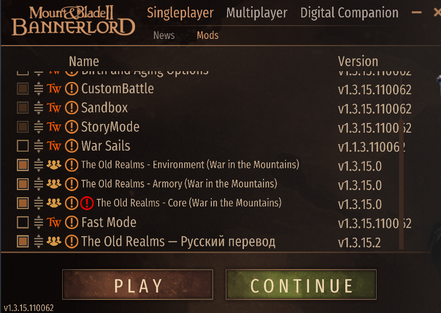

# The Old Realms — Русский перевод

Самостоятельный модуль-перевод для Mount & Blade II: Bannerlord-мода **The Old Realms** (Warhammer Fantasy). Переводит основной мод (TOR_Core) и оружейный аддон (TOR_Armory) на русский язык.

**Текущая версия:** `v1.3.15.19` (совместима с TOR_Core v1.3.15)

## Как устроено

В отличие от предыдущих версий, которые распространялись как sidecar-пачка XML-файлов, заменяющих файлы внутри TOR_Core, это **отдельный Bannerlord-модуль** со своим `SubModule.xml`. Он:

- Появляется в списке лаунчера как обычный мод — включается галочкой.
- Загружается **после** TOR_Core и TOR_Armory, перекрывая их строки локализации и несколько GUI-префабов.
- **Не трогает файлы TOR_Core** — при апдейте TOR_Core перевод не затирается.
- Содержит переводы сразу для Core и Armory в одном модуле; TOR_Armory опционален.

## Установка



### Вариант 1. Steam Workshop (рекомендуется)
Подписаться на модуль в Workshop. Включить в лаунчере, убедиться что он **ниже** TOR_Core в порядке загрузки. В настройках игры выбрать русский язык.

### Вариант 2. Вручную из GitHub
1. Скачать последний релиз из [Releases](./releases) (zip с содержимым папки `TOR_RU_Translation/`).
2. Распаковать в `…\Mount & Blade II Bannerlord\Modules\` — должна появиться папка `TOR_RU_Translation/`.
3. В лаунчере включить модуль, убедиться что он ниже TOR_Core в порядке загрузки (как на картинке выше).
4. В игре выбрать язык **Русский**.

### Шаг 3 (обязательный для русских ink-квестов)

Текстовые книжные квесты (`.ink`) — `Деревня, поражённая чумой`, `Повешенные`, `Пруд`, `Культист среди нас`, `Крепость Фоззрика` и ещё 23 — это отдельные файлы TOR_Core. Bannerlord не умеет их подменять через локализационный модуль, поэтому переводы копируются руками (30 секунд).

1. Открой папку модуля перевода:
   ```
   …\Modules\TOR_RU_Translation\InkStories_RU\
   ```
2. Открой папку TOR_Core:
   - **Workshop-версия TOR_Core:**
     ```
     …\steamapps\workshop\content\261550\3025574678\InkStories\
     ```
   - **GitHub/ручная версия TOR_Core:**
     ```
     …\Modules\TOR_Core\InkStories\
     ```
3. (Рекомендуется) Скопируй содержимое `InkStories\` в любой бэкап — на случай отката.
4. Выдели в `InkStories_RU\` **все** файлы (`*.ink` + `include.ink`) и скопируй в `InkStories\` с заменой. Файл `ЧИТАТЬ.txt` копировать не обязательно (но можно, он ничего не сломает).
5. Перезапусти игру.

Полная пошаговая инструкция с путями под твою установку — в `TOR_RU_Translation\InkStories_RU\ЧИТАТЬ.txt`.

**Откат:** переустанови TOR_Core через Steam (Unsubscribe → Subscribe) — файлы восстановятся. Или распакуй свой бэкап из п. 3 обратно в `InkStories\`.

## Зависимости

| Модуль | Роль | Обязательность |
|--------|------|----------------|
| Native / SandBox / SandBoxCore / StoryMode | стандартные модули Bannerlord | обязательны |
| **TOR_Core** | основной мод The Old Realms | обязателен |
| TOR_Armory | оружие + броня TOR | опционально |

Если TOR_Armory не установлен — перевод оружия просто не применится, ошибки не будет.

## Структура репозитория

```
TOR_RUS/                          ← корень этого репозитория
├── README.md                     ← этот файл
├── DescriptionShort.txt          ← короткое описание для Steam Workshop
├── Description_RU.txt            ← полное описание Workshop (RU, BBCode)
├── Description_EN.txt            ← полное описание Workshop (EN, BBCode)
├── ModuleIcon.png                ← иконка превью Workshop (512×512)
└── TOR_RU_Translation/           ← сам модуль — это идёт в Bannerlord/Modules/
    ├── SubModule.xml             ← манифест модуля
    ├── ModuleData/
    │   └── Languages/RU/
    │       ├── language_data.xml          ← описание русского языка
    │       └── str_tor_*-rus.xml          ← 33 файла строк (Core + Armory)
    └── GUI/
        └── Prefabs/                       ← переопределённые GUI-префабы
            ├── BattlePrayerBook/BattlePrayerBook.xml
            ├── Crafting/Enchanting.xml
            ├── Inventory/InventoryTooltip.xml
            └── SpellBook/SpellBook.xml
```

Содержимое `TOR_RU_Translation/` — это готовый к установке Bannerlord-модуль. Остальное в корне — метаданные для публикации в Steam Workshop и страница репозитория.

## История изменений

Полный лог — в [CHANGELOG.md](TOR_RU_Translation/CHANGELOG.md).

### v1.3.15.19 (2026-05-17)

Hotfix порядка загрузки. В `SubModule.xml` атрибут `order="LoadAfterThis"` у `TOR_Core` и `TOR_Armory` говорил автосортировке лаунчера ставить перевод **выше** TOR_Core — и оригинальные английские строки перезаписывали наши русские. Заменено на `LoadBeforeThis`: теперь TOR_Core / TOR_Armory грузятся **до** перевода, как и было в README. Спасибо игроку за репорт.

### v1.3.15.18 (2026-05-17)

Большой sweep по семантическим ошибкам — **~150 точечных правок в 3 файлах**. Триггер — игрок прислал скриншот гоблина-шамана с диалогом «Ты просто **дворф**» (в оригинале `runty` — «мелкий», созвучное с `dwarf` сбило прежнюю редакцию). **22 hardcoded строки** из `TOR_Core.dll` теперь на русском: stat-tooltip оружия (**Урон / Скорость / Точность / Лимит боезапаса**), shader cache popup при первом запуске (**Важное предупреждение / Прогреть / Не сейчас** — снижает риск краша `Bake Terrain`), alliance vote UI, ability/companion/rune popup'ы, Nurgle Cultists quest. **WH-канон по всем расам:** Damsel → Дева, Lahmian → Лахмия, Glade Captain → Капитан Поляны, Wight King → Король Мертвецов, Bright/Light Wizard разведены (Огненный Маг / Маг Света), arcane → тайный, duke → герцог, Beasts → звери, Serpent → Змей, undeath → нежить. **Гоблинский кластер** (`tor_wanderer_greenskins_*`, 22 правки): runty → мелкий (было дворф), spear chukkas → спир-чукки (было копья-чучела), gobbos → гоблины (было «ГОВНО БЕЖИТ»), GET LOST → ВАЛИ ОТСЮДА, Mork → Морк, Pay attenchun → слушь сюда, proppa → нормальный, pansy → хлюпик, Farewell → Прощайте. **Гринскин-кланы:** все 52 имени `greenskins_clan_name_*` были сдвинуты на +1 ID — каждый клан назывался именем следующего (Crookedhoodz показывался как «Гоб-Глоты»). Сдвиг исправлен, для ID=1 добавлено новое каноничное имя «Кривокапюшонники». **Wardsave** в seal-описаниях × 4: Вардсаве → Защитный оберег. **Дубликаты ID** `str_village_woman_*` × 4 удалены из settlements (где значения были хуже townspeople-версий с гендер-маркерами). Транслит-фиксы: Реквирес → Требуется, виталитиум → Жизненное покровище, Древесный пимбол → Символ Древесного народа, амея → Змей, «Богов над тобой хранят» → «Да хранят тебя боги».

### v1.3.15.17 (2026-05-14)

Канон-аудит бретонских имён и топонимов по фидбэку игроков (**~136 правок в 8 файлах**). **Луэн/Луон/Луну → Луан Леонкёр** (король Бретонии, 3 разнобоя в файлах → 1 канон). **Brass Keep:** Бронзовая Крепость → **Медная Крепость**. **Massif Orcal:** 12 написаний → **Массив Оркал**. **Massif Choppas:** Массив Рубил → **Племя Горных Рубил**. **Quenelles → Кенель**, **Gisoreux → Жизоро**, **Montfort → Монфор**, **Ludenhof → Люденхоф** (нем. ü→ю). Точечно: «Танкред ИИ» → «Танкред II Кенельский», Орк-Хевер → Орк-Рубила, Рокхевер → Каменотёс, Хайсм Стаутхарт → Хизме Храброе Сердце, Зверобой → Звероубийца, Король-Истребитель → Король-Убийца, Херман → Херманн. Каскады прошли по описаниям имперских лордов (Хохланд, Остермарк, Мут, Пустошь, Рейкланд), дворфских холдов (Азгараз, Хирн, Кадрин), гринскинов (Bad Axes, Massif Choppas, Black Sunz), нурглитов Медной Крепости, эльфов Атель Лорен и описанию культуры Бретоннии в энциклопедии.

### v1.3.15.16 (2026-05-13)

**Гендер-маркеры** для системы склонения Bannerlord на ~3 230 предметах и юнитах в 19 файлах — native-модификаторы «Раздробленный/Изящный/Большой колчан {ITEMNAME}» теперь согласуются с русскими именами. **Описания поселений** Бретоннии/Империи/Эонира переписаны под живой стиль; **Bastonne → Бастонь** глобальный канон-каскад. **Канон-аудит 600+ имён лордов (~174 правки)** + чистка чистых транслитов: **Йоин Битва/Флее → Вступить в бой/Бежать**, орочьи лорды (Риппа Ов Армз → Рукорвач, Сли Свити Боллокс → Хитрюга Сладкобрех, Хугг 'Уртбринга → Хугг Боледав и др.), **~80 дворфских композитов** (Иронспике → Железный Шип, Тундерхаммер → Громомолот, Гранитфист → Гранитный Кулак, Стонефури → Каменная Ярость и т.д.), **унификация «Демоноборец»**. **Несоответствия фракций**: Племя Некснапперс/Переломщиков-Шей → Племя Шееломов; Монтфорт → Монфор; Брасс/Латунная/Фертной Крепость → Бронзовая Крепость; Массиф Чоппас → Массиф Рубил; Клан Стеелклад → Клан Стальной Доспех. **In-game фидбэк (~32 правки)**: Полурыцарь Грифона → Рыцарь-Демигриф Грифонов, Чемпион Некроманта → Некромант-Чемпион, Хаосный Боец Склепа → Боец Ямы Хаоса, Щитовый Унгор → Унгор-Щитоносец, Кнутовка → Кнут, Одинорог → Единорог. **Хаос-аудит (~50 правок)**: «Хорна» → «Кхорна», «Сланаешск\*» → «Слаанеш\*», «Хаосный X» → «X Хаоса», Таал'с Чосен → Избранники Таала. **Описания способностей (15 правок)**: «Арканный Кондуит» → «Канал Тайной Магии», «Сеар» → «Палящий огонь», «Темпест» → «Буря», «Баркскин» → «Древесная Кожа», «Безумное Битие» → «Зверь Спущен с Цепи», описание Knightly Strike было от другой способности — переписано. **Career-описания**: переписан корень орочьего босса (был машинный салат), «сухарами»/«пухарей» → «дриадами», «Переподумав, я решил ещё подумать» → «Подумав ещё, я решил пока повременить». **itemtraits — 417/417 покрытие через DLL** (магические улучшения предметов, аспекты, печати — все на русском). **Hideout — 230/230** через прямые переводы + fallback-ID. **Mojibake-аудит чист.** **Итого ~385 точечных правок в 16+ файлах помимо гендер-маркеров.**

### v1.3.15.15 (2026-05-05)

Переведены **415 свойств магических предметов** (Тёмный Магистр, амулеты вааагха, дворфьи руны, школы магии, благословения богов, эльфийские/вампирские чары). **Авто-загрузка ink-квестов** (Фоззрик, Пруд, Луг, Культисты Нургла…) — bat-установщик больше не нужен. Транслит-чистка категорий оружия и редкости («Ункоммон/Епик» → «Необычное/Эпическое», «Коуч Пика» → «Копьё с упора», «Двуручное оружие Топор» → «Двуручный топор», «Орк Топор/Меч/Булава» → «Орочий…», «штаб» → «Посох», ~25 строк). Канон-привод имён школ магии (Шамон/Шийш/Гхьран/Гхур/Акши/Азыр, ~85 замен) и **«Дави» → «Дворфы»** в 7 файлах (~70 + 15 правок падежей). Багфиксы: «Ревил Гна» → «Ревильская скаковая лошадь», «пиний Ветер» → «синий Ветер», «Раидинг» → «Налёт», «как вайта» → «как могильника», «зеленые скверны» → «зеленокожие».

### v1.3.15.14 (2026-05-01)

Большой аудит-патч по фидбэку игроков и сплошной сверке корпуса перевода (16 257 строк, 34 XML-файла). **~85 правок** в 8 файлах. **Книга заклинаний:** «Тиер1/Тир2/Тиер3/Тиер 4» → «Уровень 1–4» + починены 6 spellbook-строк («Куррент Ветра магии», «Херо Имя», «Заклинание Чтение заклинания Уровень», «{RATE}/хоур»). **Магические улучшения вампиров (Тёмный Магистр):** 14 имён enchant — «Бульвар Кровной Крепости» → «Оплот Кровавой Крепости», «Превенение аспидов» → «Глумление Аспидов», «Прикосновение джазта» → «Гагата», «Связи Тьмы» → «Узы Тьмы», «У'соран» → «В'соран» и др. **Храмовники** (5 мест карьеры + backstory вместо «Темпларов»). **Канон-имён:** Энгельбрехт Хольцернспеер ×2 + Енгел*→Энгель* ×7, Эдвард, Эммануэль (доп.), Музильон (доп.), Рейкланд (доп. ×2), Бретонния (доп.), Крюгенхайм (доп.), Фолькмар, Сигмаринген ×2, Налётчики-зверолюды, Налётчики Хаоса, **Янтарь** ×7. **Восстановление потерянной первой буквы** после прежних bulk-замен — 11 мест («п моей»→«С моей», «п спиной»→«Со спинами», «хвали полнце»→«хвала солнцу» и др.). **Типографика:** ASCII-кавычки в названиях книг → ёлочки, удалён комментарий переводчика «- власть здесь звучит неуместно…» из tooltip'а Empire prestigenoble, удалены `[5a]` сноски Lexicanum в описании Тируса Горманна. **Описание Нульна** — Серые/Чёрные горы с заглавной, перевал Чёрного Огня.

### v1.3.15.13 (2026-04-28)

Аудит-патч по фидбэку игроков, **~140 правок** в 13 XML-файлах. Фиксы по присланным скриншотам (гномье «становление», диалог найма, Темплар-охотник, поломанные U+0301 «Латаный камзо̀л»/«Вожа̀к»). **+95 пропущенных переводов:** диалоги Eonir spellsinger в Лаурелорне (High/Dark/Mercenary Magic), vampire spelltrainer, 32 регалии Dark Elves (Ведьма-Эльфийка, Сестра Резни, Чародей Огня Судьбы, Смертная Карга и др.), полный комплект Flagellant. **Канон-фиксы имён:** Эммануэль (вместо Эмануэль ×9), Альптраум ×6, Темплхоф ×4, Хельмут ×6, Ульфар ×5, Йозеф/Вальмир/Хольсвиг, Маннфред фон Карштайн. **Топонимы:** Жуфбар, Изоргрунг, Музильон, Майсонтааль, Парравон, Монфорт, Убершрайк ×4, Крюгенхайм ×3. **WH-каноны:** Тзинч (вместо Тзинца ×8), Грунгни (вместо Гронгни/Грюнгни). Ё-восстановление в перках.

### v1.3.15.12 (2026-04-26)

Багфикс-патч по системному аудиту, **~600 правок**. Восстановлены массовые bulk-sed артефакты: «С→п» (пегодня/пейчас/пердце/пуществует/пам — 20+ слов), потеря «З» (анай/анание/аначит) и «За→аа» в перках, потеря «Ж» (ахуфбар→Жуфбар), «д» (Гилью→Гильдию), «о» (ремесл→ремесло). **~150** правок капитализации после точки и в начале строк. **Орочьи транслиты** заменены на осмысленный русский: Шиниес→Блестяшки, Нуффин'→Ничё, Тинкерер→Мастеровой, Булли→Задира, Квартамаста→Кварт-мейста; Жубы во всех орочьих контекстах. **Канон-правки:** оф Артоис→д'Артуа, Муассилон→Музильон, Силверфоот→Среброног, бретонниан→бретонский (×16), «зеленых дворфов»→«зеленокожих», Кровный рыцарь, Тёмноэльфийские работорговцы, Вампир-лорд, Кракwальд→Краквальд (visual confusable). **Дубли** «Двуручное двуручное», «полностью полностью», «Одноручное оружие Топор», `&amp;amp;`. **Гендер-баг** мужского титула эонира («Благородная дочь»→«Высокорождённый Лаурелорна»). **7 fallback-плейсхолдеров** «по умолчанию для X» заменены осмысленным текстом. Подробности — в CHANGELOG.

### v1.3.15.11 (2026-04-25)

Большой канон-аудит ~1300 правок в 24 файлах. **Глобальные ренеймы под лор:** Mousillon → **Музильон** (125 мест), Dwarf → **Дворф/дворфский** (313 мест, было «Гном/гномий»), Carstein → **Карштайн**, Mannfred → **Маннфред** (двойная нн), Volkmar → **Фолькмар**, Stirland → **Штирланд**, Middenheim → **Мидденхайм**. **Townspeople** — переписаны 9 файлов (Empire, Bretonnia, Mousillon, Asrai, Eonir, Dawi, Sylvania, Blooddragons, Chaos): убраны кальвинистские проповедники у эльфов и вампиров, имперские торговцы из вампирских файлов, числовые MT-суффиксы. **Грамматика и опечатки:** Грюгни→Грунгни, Хелденхэммер→Хельденхаммер, Длиннобородый, дворфскоей→дворфской, посола→посоха, Ножка меча→Навершие меча. **Ink-квесты:** 3 файла переписаны под канон. Подробности — в CHANGELOG.

### v1.3.15.10 (2026-04-24)

Крупный канон-аудит: **эльфы** (Asrai/Eonir — Лаурелорн, Ультуан, Атель Лорен, Отряд Сородичей вместо Кибанды), **нежить** (`фон` вместо `вон` Карштейн ×76, Hex Wraith = Проклинающий Призрак, Blood Dragon = Кровавого Дракона), **религии** (Шальи, Валайи, Хаос Неделимый, Культ Владычицы Озера). Глубокая чистка `heroes` — 130+ правок имён, топонимов, мифологии. Проектно-широкая унификация канона **Бретоннии** (сущ. 2н, прил. 1н). Пойман массовый сбой автозамены **«сила→пила»** (12 мест) и **«среди→преди»**. ~240+ правок в 13 файлах. Подробности — в CHANGELOG.

### v1.3.15.8 (2026-04-21)

Аудит названий поселений, городов, деревень и герцогств по WH Fantasy канону (waha.fandom.ru, warhammerfantasy.fandom.ru). ~100 правок: подмены имён (Латайн, Лез-Оксон, Бернау, Зексау), WH-канон (Жуфбар, Виверн, Гизоро, Штерниесте, Латунная Крепость), герцогства Бретоннии (Аквитания, Артуа, Бордело, Куронн, Кенель, Лионесс), французские топонимы (Виши, По, Лурд, Лаваль, Кондом, Монтескьё), грамматика («Разбитый Кулак», «Воющая Пропасть»), имена NPC (Альбрехт, Эжен, Клод, Кристина).

### v1.3.15.7 (2026-04-20)

Крупная чистка транслит-мусора: 300+ правок. Тиры рыцарства (Уннигтли→«Бесчестный», Хоноурабле→«Благородный»), уровень Ваагх (Унновн→«Неизвестно»), диалоги чарователей, ink-квесты теперь подтягиваются без ручной установки.

### v1.3.15.6 (2026-04-19)

**Большая чистка по жалобам игроков — транслит, битые ID, непереведённые строки**

Фиксы по скриншотам пользователей (текстовые квесты, вампирские персонажи, ресурсы, кавалерийские перки, карта мира).

**Боги и религии (чистые опечатки/OCR):**
- `пигмар` → `Сигмар` — 57 мест в `str_tor_strings-rus.xml` (все падежи). В v1.3.15.4 было заявлено «5× пигмар→Сигмар», но пропущено 52 вхождения.
- `Улик` → `Ульрик` — 17+ мест в 6 файлах (религии, герои, поселения, шаблоны персонажей, стрингс, ror_settlement_templates).
- `Грингни` → `Грунгни` (гномский бог-предок); `Грунгни Резкий` → `Грунгни Кузнец`.
- `Волчий культ в Миденхейме` уточнён: «карликового предка-бога» → «гномьего бога-предка».

**Вампирские карьеры / ветки:**
- `Стригань Донму` → `Стригани-донму` (главы караванов); `Стригань-изверг` → `Стригани-повеса` (Rake).
- `Стриганские караванщики` → `Стригани-караванщики`; в описаниях «в семье стриган» → «в семье стриганей».
- `Начинающий некромантер` → `Начинающий некромант`; `Вампирская знать.` (лишняя точка) → `Вампирская знать`.
- `Призывная милиция` → `Призывное ополчение`; `Хотеный преступник` → `Разыскиваемый преступник`; `Повелительница Леди` → `Дева Владычицы`; `Сторож-фермер` → `Йомен-страж`; `Свободный муж` → `Свободный общинник`.
- `Могилокопы` → `Могильщики`; `Торфокоп` → `Торфяник`; `Курьер Кордона` → `Нарушитель кордона`.
- `Путник-рыцарь Мусиллана` → `Рыцарь-странник Муссильона`; `Куртизан Мусиллана` → `Муссильонский придворный`; `Вампир Мусиллана` → `Вампир Муссильона`.
- `некромантер*` → `некромант*` во всех падежах — 5 файлов.
- `Мусил*` / `Мусиллан*` / `Мусильский` → `Муссильон*` / `Муссильонский` — все падежи в 4 файлах.

**Вампиры / нежить / топонимы:**
- `Чёрный Рыцарь Кастла Стерниести` → `Чёрный Рыцарь Замка Штерниесте` (+ `Могильный Страж Стерниесте`, `Скелет Стерниесте`).
- `Склеп Воин` → `Воин Склепа`; `Скелет Воин` → `Скелет-Воин`; `Скелет Копейщик` → `Скелет-Копейщик`.
- `Некромант-Чемпион Броня` → `Бронированный Некромант-Чемпион` (+ `(двуручный)`).
- `Могильный Страж Воин` → `Могильный Страж-Воин`.
- `Вайтов` / `Король Вайтов` → `Король-Могильник` (Wight King) — 6 мест (герои + 5 артефактов).
- `Тряпки Вайта Кирна` → `Рубище Курганного Призрака` (Cairn Wraith).
- `Конигштайн Скелет/Копейщик/Мечник` → `Скелет/Копейщик/Мечник Конигштайна`.
- `Аспирант Воин` → `Воин-Аспирант Хаоса`.
- `Эонирский Бронированный Отряд Сородичей Воин` → `Эонирский Бронированный Воин Отряда Сородичей`.
- `За́к Д'Эпé` (диакритика не рендерится шрифтом Bannerlord → в игре «За?к Д'Эпé») → `Замок Д'Эпе`.

**Бретония / рыцари:**
- `Бретонский Рыцарь Квеста` → `Бретонский Рыцарь-Странник` (Questing Knight).
- Унификация доспехов и шлемов questing_knight: все `рыцаря-поисателя / рыцаря-крестоносца / Рыцаря-Паломника / рыцаря-путника` → `Рыцаря-Странника` (11 артефактов в `str_tor_armors-rus.xml`).
- `Лади` → `Леди` (7 аристократок) + побочные имена: `Гиулиа → Джулия`, `Николетте Д'оисмент → Николетт д'Уазмон`, `Турíн → Турин`, `«ле бûчерон» → «Дровосек»`, `Хунтсмаршал → Главный Егерь`, `Харбор Мастер Еричт вон Фриесен → Начальник порта Эрихт фон Фризен`.
- Удалена латинская диакритика (é, è, ê, à, â, ô, û, î, ï, ù, ç, ñ) внутри кириллических имён — ≈85 замен в `cultures/campaign_lords/kingdoms/other_items`. Шрифт Bannerlord не рендерит их и выдавал `?`.

**Эльфы — дубли и перепутанные ростеры:**
- Убраны 3 дубликата у Асраев: `glade_knight` «Всадник Полян» → «Рыцарь Полян»; `eternal_warden` «Страж Полян» → «Вечный Хранитель»; `master_scout` «Разведчик Тёмной Чащи» → «Мастер-Разведчик». `waywatcher_sentinel` → «Старший Дозорный».
- `caravan_guard` «Асрай Торговец» → «Асрай Охранник Каравана»; `caravan_captain` «Асрай Мастер Торговец» → «Асрай Предводитель Каравана».
- Высокие Эльфы (seaelf) больше не носят ростер Асраев: `sentinel` «Всадник Полян» → «Часовой Морских Эльфов»; `spearman` «Страж Полян» → «Копейщик Морских Эльфов».

**Ресурсы и UI (видно во всех tooltip'ах!):**
- `Тёмный Енерги` → `Тёмная энергия` (custom_resource_name_darkenergy).
- `Упкееп` / `Upkeep` → `Содержание` (generic_upkeep + захардкоженный `tor_upkeep`).
- `Меат` → `Мясо`; `Престиге` → `Престиж`; `Оатголд / Озголд` → `Золото клятв` (+ описание переписано); `Лес Хармони` → `Лесная гармония`.
- `Лигтнинг` (2 места) → `Молния` (тип урона).
- `Унинспиринг` → `Невпечатляющий` (уровень рыцарства).
- `Амбер Спир` → `Янтарное Копьё` (заклинание Lore of Beasts).
- `Алтарь Грингни Резкого` → `Алтарь Грунгни Кузнеца`.
- Описание Тёмной энергии: «своих нежити» → «своей нежити».

**Кланы, племена, фракции (битые ID + транслит):**
- Исправлены 85 битых ID с префиксом `str_eor_*` → `str_tor_*` в `cultures-rus` и `townspeople_sylvania-rus` — без этого переводы просто не подтягивались, игра показывала английский.
- 13 битых ID с `faceion` → `faction` (breeonnian→bretonnian, desereer→deserter, looeer→looter, culeise→cultist, beasemen→beastmen).
- `Ред Ее` / `Ред Ее Трибе` → `Красный Глаз` / `Племя Красного Глаза` (Red Eye Tribe).
- `Дефф Гриндаз Триба` / `Дефф Гриндаз Трибе` → `Племя Дефф Гриндаз`.
- Названия клановых родов: `Паинбрингерс → Приносящие Боль`, `Доомборн → Рождённые Роком`, `Горефестерс → Пирующие Кровью`, `Иронбеард → Железнобородые`, `Стонехаммер → Каменномолот`, `Коппербак → Меднобородые`, `Краганд → Скалорукие`, `Флинтеарт → Кремнесердцы`.
- Фракции: `Норсканы-разбойники → Норсканские налётчики`, `Империя Десертерс → Имперские дезертиры` (+ повтор в `clans-rus` для Mountain Bandits), `Гоблин Раидерс → Гоблины-налётчики`, `Хаос Култистс → Культисты Хаоса`, `Херримаултс → Эрримольты`, `Зверолюды Варбанд → Банда Зверолюдов`.
- Placeholder `Добавить_ме_ин_културес_ксмл` (Add_me_in_cultures_xml) → `Гразла` (женское гоблинское имя).
- Ещё два клановых имени: `Норсец Раидерс → Норсканские налётчики`, `Дручии Славерс → Друкхи-работорговцы`.

**Поселения и локации:**
- `Дефендерс Квартерс` → `Квартал Защитников`; `Деатйакс Квартерс` → `Квартал Смертодолов`; `Вилдвуд Рангерс` → `Рейнджеры Дикого Леса`.
- `Клеаринг` (Clearing) → `Поляна`.
- `Стернсмен` → `Штерниесцы`.
- `Кастлом Кенеллес` → `Кастель-Кенелль`; `Кастла Монтфор` → `Кастель-Монфор`.
- Дубликаты `Всадник Полян`/`Разведчик Тёмной Чащи` у разных ID разведены (см. эльфы).

**Массовые системные замены:**
- `карлик*` → `гном*` во всех падежах и прилагательных (135 замен в 9 файлах; `карликовый → гномий`, `карликовыми → гномьими` и т.д.).
- `Дварф*` / `Дварфен*` → `Гном*` / `Гномий*` (68 замен в 9 файлах).
- `Гринскин*` → `Зеленокож*` (7 мест в карьерных описаниях).
- `Реикланд` → `Рейкланд` (4 места).
- `Племеню` → `Племени` (2 опечатки).

**Сомнительные машинные переводы в заклинаниях:**
- `Отсасывайте ветры` (siphon the winds — NecrarchRoot) → `Вытягивайте Ветры Магии`.
- `маг отсасывает жизненную силу` (spirit leech) → `маг высасывает жизненную силу`.
- `Отсасывание души` (описание Аметистовой школы магии) → `Вытягивание души`.
- `+5% урона от заклинания 'Освещение'` (UnhallowedSoulPassive4) → `+5% урона от заклинаний магии Света` (Lore of Light).
- `Саважность Гхура` → `Свирепость Гхура`; `Воры Гхура` (crows перепутали с thieves) → `Вороны Гхура`; `Ветром Шамони` → `Ветром Шамона`; `Балтасар` → `Балтазар`.
- Описание OathGold: «Озголд (или Галбараз в хазалидском)» → «Золото клятв (или Галбараз на хазалиде)».

**Имена фамилий (главный фикс):**
- `empire_generic_clan_name` был переведён как `вон{ORIGIN_SETTLEMENT}` — без пробела, «вон» вместо «фон». В игре при создании персонажа-вампира это выглядело как «von 2». Исправлено на `фон {ORIGIN_SETTLEMENT}`.
- Ключ `vampire_counts_generic_clan_name` вообще отсутствовал в переводе (игра падала на английский fallback) — добавлен.
- Удалён дубликат с опечаткой в ID: `vampire_counes_generic_clan_name`.

**Ink-квесты (текстовые сценарии):**
- `Meadow.ink`, `Pond.ink`: оставшиеся английские утечки `Silver moonlight / Golden sunlight` → `Серебристый / Золотистый свет`; `Improved by Lore of Life` → `усилено магией Жизни`.
- Добавлен `УСТАНОВИТЬ_ink.bat` — автокопировщик ink-файлов в папку TOR_Core (сам находит, делает бэкап, заменяет). Устраняет первопричину жалобы «в квесте половина на английском»: игроки пропускали шаг ручного копирования.
- Переорганизована структура папки: `InkStories_RU/` теперь содержит подпапку `InkStories/` с .ink-файлами + `ЧИТАТЬ.txt` + `УСТАНОВИТЬ_ink.bat` в корне.

**Добавлены ~115 ранее отсутствовавших ключей перевода (показывались на английском):**

По анализу лог-файлов `TOR_log*.txt` выявлено 133 уникальных ключа с ошибкой `Couldn't find text with id`. Все они теперь переведены. Среди них:

- **Приход в поселение**: `tor_settlement_graveyard_introduction`, `tor_settlement_artisan_introduction`, `tor_settlement_arrival_castle_other`, `tor_settlement_arrival_town_player`, `tor_settlement_arrival_village_other`, `tor_settlement_arrival_village_player`, `tor_settlement_graveyard_raise_dead_interrupt`, `tor_graveyard_nightwatch_name`, `tor_artisan_district_title_text`, `tor_cannonball_pile`.
- **Вампиры**: `tor_suffering_sunlight` («Страдания от солнечного света» — бафф при дневной активности), `tor_cc_learned_necromancy_text`.
- **Наём и спутники**: `tor_hire_companion_introduction` («Чем я могу помочь?»), `tor_hire_companion_begone`, `tor_wanderer_leave`, `tor_companion_hire`, `tor_companion_hire_accept`, `tor_companion_hire_decline`, `tor_companion_hire_cant_afford`, `tor_companion_hire_response`, `tor_hire_companion_payment`, `tor_hireling_abandon_party_*`, `tor_hireling_desert_warning_text`, `tor_hireling_yes_text` / `no_text`.
- **Войска и улучшения**: `tor_upkeep` («Содержание»), `tor_cost` / `tor_cost_not_enough` («Стоимость: …»), `tor_upgrade_to`, `tor_upgrades_disabled`, `tor_required_xp`, `partyscreen_resource_text`, `tor_gained_resource_notification_text`.
- **Урон и магия**: `tor_damage_display_ally_plural` / `singular`, `tor_damage_display_friendly_fire` / `_with_kills`, `tor_ability_anvil_not_placed`, `tor_ability_too_far_from_anvil`, `tor_waywatcher_select_arrows_text`.
- **Гномы**: `tor_dw_brewer_recruit_rangers_*` (5 строк пивовара-вербовщика), `tor_dw_oath_gold_spending_*` (3 строки Золота клятв), `tor_dw_donate_miners_to_guild_text`, `tor_dw_spend_oath_gold_hint_text`, `tor_enchanting_title` («Зачарование»), `tor_runesmithing_title` («Рунокузнечество»), `tor_ironbreaker_level_too_low_text`.
- **Зеленокожие (орочий стиль)**: `tor_greenskin_appetite`, `tor_greenskin_chop_text` («Порубить»), `tor_greenskin_cant_chop_text`, `tor_greenskin_not_a_prisoner_text`, `tor_orc_boss_extort_teef_text`.
- **WAAAGH-уровни (4 уровня × 3 строки = 12)**: `petty_squabblin` («Мелкая Грызня»), `internal_fightin` («Драки Внутри»), `ere_we_go` («Ваагх пошёл!»), `waaagh` («ВАААГХ!!!»). Плюс `tor_waaagh_bar_tooltip`.
- **Пещера троллей (сюжетный ивент)**: 17 строк — атака, бой, победа, поражение, приманивание мясом, отступление, выбор войск (`tor_trollcave_*` + `tor_troll_greeting`).
- **Руны на войсках**: 12 строк (`tor_unit_rune_*` — добавление, стоимость, предупреждение о замене, только в гномьем Караке).
- **Размер отряда (бонусы культур)**: `tor_party_size_desc.Greenskins`, `DwarfPenalty`, `WoodelfPenalty`, `CaravanOfDeath`, `FriendOfUndead`, `GoblinWeight`, `VampireLord`.
- **Камни Силы**: `tor_powerstone_choose_*`, `tor_powerstone_create_text`, `tor_powerstone_not_experienced_enough_text`.
- **Охотник на ведьм / истребитель / охотник**: `tor_witch_hunter_*`, `tor_slayer_tier_too_low_text`, `tor_hunt_perk_animal_large` / `medium`, `tor_stats_troll_bonus_text`.
- **Прочий UI**: `tor_inquiry_decline_text` («Отказаться»), `tor_inventory_race_restriction`, `tor_no_artillery_inventory`, `tor_refine_all_text`, `tor_snow`, `tor_toggle_on_text` / `off`, `tor_trebuchet`, `tor_wounded`, `tor_faction_leader`, `eonir_envoy_low_clan_tier_text`, `tor_ai_activate_alarmed`.
- **Native Bannerlord override**: `zWaVxD6T` и `PThYJE2U` («Скорость отряда» / «Скорость отряда:») — переопределение нативных ключей, поскольку TOR в некоторых tooltip'ах (party finance screen) передаёт строку «Party Speed» в обход стандартной локализации.

**Что пока НЕ удалось пофиксить:**
- «Daily Change» в панели ресурса — захардкожено в `TOR_Core.dll` без `{=key}`-префикса, требуется правка .NET-сборки.
- «Burden of Dark Energy Costs is too high!» — та же причина, нет ключа в xml-локализации.

### v1.3.15.4 (2026-04-19)

**Карьеры орков — массовый ремонт описаний перков**

Сверка каждой строки с английским оригиналом и приведение к единому канону. Все 7 групп выбора (по 5 перков = 35 строк) прошли пересборку:

- **Bones an' Firepitz, Power Uv Da Waaagh, Gork An Mork, Giftz From Da Great Green** (шаман)
- **Brutal Cunnin', Cunnin' Brutality, Good wiv Blockas, Leaf Nuffin' Behin', Get To Da Choppas, Meanest an' Da Baddest, Best of Da Best** (Босс)

Зафиксирован словарь терминов, теперь единый везде:

| EN (orc-speak) | RU (было → стало) |
|---|---|
| `Call uv da Great Green` | `Призыв Великого зелёного` → **Зов Великого Зелёного** |
| `Armed to da Teef` | `Вооружённый до зубов` / `Вооружённые до зубов` → **Вооружение до зубов** |
| `Mumbo-jumbo pointz` | `очки магии` / `очки мумбо-джамбо` → **Очки мумбо-джумбо** |
| `tuffness` | `выносливость` → **крепость** |
| `'ardiness` | `защита` / `готовность` → **стойкость** |
| `killin' / killy` | `убийства` / `убивать` → **убойность** |
| `Lukk` | `удача` | _(единый вид)_ |
| `mob` | `толпа` / `команда` / `отряд` → **банда** |
| `Boys / Boyz` | `бойцы` / `парни` → **Пацаны** (с большой — орки так идентифицируют себя) |
| `choppa` | `кинжал` / `меч` / `клинок` / `топор` → **чоппа** |
| `blocka` | `блок` → **щит** |
| `scrap` | `мусор` (!) → **драка** |
| `Extort Teef` | `выбивание зубов` → **Выбивание Зубов** |

Самые яркие ляпы:
- `BonesAnFirepitzKeystone`: ~~Призыв Великого зелёного **всегда готов к мусору**~~ → **Зов Великого Зелёного всегда готов к драке** (`scrap` в орк-спике — драка, а не мусор).
- `GoodwivBlockasKeystone`: ~~убивать лучше **одноручными клинками**~~ → **убойнее с очками Одноручного оружия** (перк про skill, а не тип оружия).
- `BestofDaBestPassive2`: ~~Атаки **кинжалами** на 10% быстрее~~ → **Атаки чоппой на 10% быстрее** (`choppa` — не кинжал, это орочий рубило).
- `WardenOfCavarocKeystone`: ~~**Орл Глаз** также масштабируется с езды~~ → **«Орлиный Глаз» также зависит от Верховой езды**.

**Описание карьеры Орк-Шаман**

`str_tor_career_description_OrcShaman`: сломанные артефакты `З→а` (`аАПНЕМ`, `ВаРЫВНЕМ`, `аЕЛЕНОГО ОГНЯ`) заменены на орфографически правильное `ЖАХНЕМ / БАХНЕМ / ЗЕЛЁНОГО ОГНЯ`. Падежи, согласования («эту шляпку» → «этот гриб»; «он съест её» → «Босс его сожрёт»).

`str_tor_careerchoice_description_OrcShamanRoot`: `Да Шаман из да центах ув да ВААГХ! ... для аАППИНГА и БЛАпТИНГА ... твоя запаянная энергия` → **Шаман — это центр ВААГХа! ... для ЖАХАНЬЯ и БАХАНЬЯ ... твоя зелёная энергия**.

**Описание карьеры Орк-Босс**

`str_tor_career_description_OrcBoss`: ~~«ун», стунти, хлюпикам, «пойти», Приколите~~ → **пацан, коротышам, людишкам, выдвигаемся, Приколи** (канон RU).

**Способность `Зов Великого Зелёного`**

`call_of_da_green_label_str`: ~~Призыв Зелёного~~ (обрезалось в UI, без контекста) → **Зов Великого Зелёного** (полное имя, соответствует EN `Call uv da Green`).

**Создание персонажа — орк-бэкграунд**

`str_tor_cc_origin_aserai`: ~~«зелёные воспроизводятся через споры, и один из них приземлился **на вас**…»~~ (лишено смысла — спора падает на местность, не на игрока) → **«Зеленокожие воспроизводятся через споры. Одна из них приземлилась на…»** (+ все 5 кнопок местности в винительном падеже: Скалистую / Лесистую / Снежную / Пустынную / Вулканическую местность — предложение продолжается выбором).

**Реликтовые артефакты пайплайна `п→с`**

- `tor_priest_sigmar_desc`: 5 штук `пигмар` → **Сигмар** в гимне + «Воины-жрецы», «защищает» вместо «щитит», падежи.
- `попротивление` / `попротивления` → **сопротивление** / **сопротивления** (≈9 мест в карьерах Рыцарей/Магистров/Муссильона).
- `«Каменей пилы»` → **«Камни Силы»** (Power Stones — механика мода).
- `'пила заклинаний'` → **'силы заклинаний'**.
- `+X% персонал 'заклинаний' Урон` → **+X% к урону заклинаниями** (4 места).

**Греинские описания (Зеленокожие)**

- `str_tor_trade_greenskin` / `str_tor_alliance_greenskin`: `зелёные шкуры не понимают…` → **Зеленокожие не понимают…**
- `str_tor_faction_formal_name_for_culture_aserai`: `зелёные Племена` → **Зелёные Племена**.
- `str_tor_waaagh_level_desc_ere_we_go`: `ваши Мальчики готовятся` → **ваши Пацаны готовятся** (канон).

**Ink-квесты и мелочь**

- `Meadow.ink`: утечка английского в сцене отдыха — переведено.
- `DawiAndRuneMagic.ink`: заголовок — переведён.
- `str_tor_orc_shaman_quest*_task_spellcraft`: `Магия Навык` → **Навык «Магия»**; `Вера Навык` → **Навык «Вера»**.
- `tor_feudal_oath_line2_massif_choppas`: `самый большой топор в толпе` → **самая большая чоппа в банде**.

### v1.3.15.3 (2026-04-18)

**Ink-квесты — включены в сборку**

28 текстовых побочных квестов (`.ink`) переведены на русский и теперь поставляются внутри модуля в папке `InkStories_RU/`. Для активации их нужно скопировать в `TOR_Core/InkStories/`, заменив английские оригиналы. Подробности в `InkStories_RU/ЧИТАТЬ.txt`.

Заголовки квестов русифицированы, раскладка ink-структуры сохранена (knots/stitches/diverts не переименованы — иначе ломается игровая логика). Исправлены известные падения:
- `NurgleCultists.ink` — файл был обрезан на 89-й строке, восстановлен полностью.
- Переведённые stitch-имена (`START.выборы`) и переменные (`{Знаменитость}`) возвращены в латиницу, иначе ink-движок их не находил и валил сценарий.
- Ключи Ink-условий (`-true:`/`-false:`) и имена навыков в `perform_player_skill_check(…)` возвращены к английским enum'ам — движок ждёт именно их.
- Фикс английских утечек в диалогах Meadow (сцена отдыха у лагеря), DawiAndRuneMagic (заголовок).

**Орочья терминология — сверка с русским каноном Warhammer Fantasy**

Пройден единый проход по именам войск, оружия и описаниям героев:
- `Орк-Мальчак` → **Орк-Пацан** (Orc Boy) — канон
- `Орк-Лукарь` / `Лукарь-Вождь` → **Орк-Лучник** / **Лучник-Вождь** (Orc Arrer Boy / Arrer Big Boss)
- `Гоблин-Волчатник` → **Гоблин-Наездник на Волке** (Goblin Wolf Rider)
- `Орк-Кабанщик` → **Орк-Наездник на Кабане** (Orc Boar Boy)
- `Орк-Набегача` → **Орк-Налётчик**
- `Гоблин-Тыкальщик` → **Гоблин-Копейщик** (Goblin Spear)
- `Гоблин-Пращник` → **Гоблин-Камнемёт**
- `Мерзкий Гад` → **Мерзкий Скрытник** (Nasty Skulker)
- `Орк-Забияка` / `Орк-Задирака` → **Орк-Бандит** / **Орк-Громила**
- `Чёрный Орк Берсерка` → **Чёрный Орк-Берсерк**
- `Муссильонский Виллан` → **Муссильонский Крестьянин**

Замена прошла во всех файлах: troopdefinitions, meleeweapons, heroes, campaign_lords. 199 биографий орочьих лордов выверены под новую терминологию.

**Правки создания персонажа (греинские бэкграунды)**

- Правка капитализации/падежей в выборе стартового региона для зеленокожих (снежный, скалистый, вулканический, лесной, засушливый).
- `str_tor_backstory_c_tor_wanderer_greenskins_0` — `Гримогор Железной спинки` → **Гримгор Железная Шкура** (канон).
- `str_tor_response_1_tor_wanderer_greenskins_0` — аналогичная сверка.

**ID-префикс**

`str_eor_greenskins_clan_name_*` → `str_tor_greenskins_clan_name_*` — 52 клановых имени больше не «теряются» из-за опечатки префикса.

### v1.3.15.2 (2026-04-18)

**Архитектура — перевод стал отдельным модулем**

Раньше перевод распространялся как sidecar-XML, который надо было кидать поверх файлов TOR_Core (затирался при апдейтах). Теперь это самостоятельный модуль: ставится рядом, включается галочкой, не ломается при обновлениях TOR. Переводы Core и Armory объединены в одном модуле.

**Переведены захардкоженные UI-элементы**

Часть текстовых меток в модах Bannerlord не идёт через словарь локализации — они прошиты прямо в префабах интерфейса. Эти места раньше оставались английскими даже при включённом русском. В этом релизе 4 префаба переопределены:

- **Инвентарь (тултипы):** `Item Effects` → Эффекты предмета, `Magic Item` → Магический предмет
- **Зачарование:** `Items / Enchantments / Enchant / Done` → Предметы / Чары / Зачаровать / Готово
- **Книга заклинаний:** `SpellBook / Spellcasting Stats / Done` → Книга заклинаний / Характеристики заклинателя / Готово
- **Книга боевых молитв:** `Battle Prayers / Priest Stats / Done` → Боевые молитвы / Характеристики жреца / Готово

**Массовые правки повреждённых слов**

В ранней редакции перевода часть слов пришла с буквенными подменами в начале — `С→п` и `З→а` (артефакт пайплайна). Пройдена финальная ревизия, исправлено около 500 слов:

- `пвятилище / пвятыми` → Святилище / Святыми
- `пкорость / пкрытн` → Скорость / Скрытн
- `пмотри / пмотрителя` → Смотри / Смотрителя
- `пнижение` → Снижение
- `пделайте / пдайте` → Сделайте / Сдайте
- `пхват / пхож / пчит` → Схват / Схож / Считай
- `плушайте / плужба / плужить` → Слушайте / Служба / Служить
- `пдвиг / пкелет / пнежная` → Сдвиг / Скелет / Снежная
- `пцена / пцеп / пфер` → Сцена / Сцеп / Сфер
- `пбор / пжать / пжёг` → Сбор / Сжать / Сжёг
- `ааклинатель / Аелен / аубы` → Заклинатель / Зелен / Зубы
- Сотни точечных правок в именах: Принке → Принц, Чиеф → Чиф, Еарл → Эрл, Даемон → Демон, Конигстеин → Конигштейн, Фриедерич → Фридрих, Реинфриед → Реинфрид

**Каноничная терминология Warhammer Fantasy**

- **Ветра магии:** Хыш, Шыш, Чамон, Гхур, Азир, Гхыран, Акши, Улгу
- **Боги:** Сигмар, Ульрик, Шаллья, Таал, Манаан, Моррай, Верена, Ранальд, Халгар, Грунгни, Валая, Тунгни, Горк, Морк, Курноус, Исха, Кхейн, Лоэк
- **Топонимы:** Лорелорн (было 3 варианта), Муссильон (было `Муссийон`), Сильвания (было `пильвания`), Стирланд (было `птирланд`), Пфайльдорф, Пфунциг, Пфорцен, Пфальцграф
- **Расы и войска:** Зеленокожие, Орк-Пацан, Чёрный Орк, Гоблин, Снотлинг, Скавен, Варбосс, Рейксгвардия, Блад Драгонс, Асрай, Эонир, Дави
- **Культы и организации:** `Реквиред Клан плава: 2/4` → Требуется известность клана: 2/4 (35 карьер)

**Правки перков, способностей и магии (150+ штук)**

Ранее около 100 перков оставались английским транслитом (Импертурбабле, Либрариан, Миракле, Дампенер, Оверкастер, Форесигт, Ексчанге, Девотее, Новике Молитвы, Фигтинесс). Теперь все перки в карьерных меню читаются по-русски: Невозмутимый, Библиотекарь, Чудо, Гаситель, Сверх-заклинатель, Прозорливость, Обмен, Преданный, Послушник, Боевитость.

Магические термины: `заклинание еффективенесс` → Эффективность заклинаний, `заклинание Длительность` → Длительность заклинаний, `Вард Похранить` → Защитный оберег (Ward Save), `Порох фиреармс Точность` → Точность огнестрельного оружия.

Добавлены пропущенные переводы финальных (топовых) перков:
- `True Transmutation` → **Истинная Трансмутация** (верхушка магической ветки — вешает 2 чары на оружие, дави — 3)
- `Miracle` топ-уровень → описание «Позволяет наложить 2 благословения на оружие» (жреческий аналог)

**Орочья броня и оружие**

- `Дикое Детали` → Дикарское снаряжение Пацана (нагрудник)
- `Дикарские гоблинские частицы` → Маска Дикого Пацана
- `Дикий Мальчик Костяшки` → Костяные наручи Дикого Пацана
- `Дикарьские ноги с краской` → Раскрашенные ноги Дикого Пацана
- `Дикое доспехи` → Доспех Дикаря (баттанский)
- Меч-серия `Орчий мальчик Слэша` → Слэша Орка-Пацана + все детали крафта

**Меню и диалоги**

- Главное меню TOR: «Войти в Старый Мир», «Готово», «Создать кэш шейдеров»
- Боевые команды: `Начать а бравл` → Начать драку
- Карьера: `пвободные очки карьеры` → Свободные очки карьеры
- Диалоги магии: `Да И ам.` → Да, я здесь.
- Бекграунды персонажа: `Воин-наемник пвободной Компании` → Воин-Наёмник Вольной Роты, `пвободный муж` → Свободный муж, `Бегун кордона` → Курьер Кордона
- Описания поселений с рассогласованной грамматикой приведены к нормальному виду (Гитгирт, Скраклаз Унгор и др.)
- Диалог про культ Шалльи: `пестринство` → Сестринство
- Цеха и гильдии: `Гилья инженеров` → Гильдия инженеров

**Восстановление повреждённых файлов**

4 XML-файла были структурно повреждены ранее (тег `<sering>` вместо `<string>`, `eexe=` вместо `text=` — массовая подмена `t→e` в метаданных). Восстановлены с перекрёстной сверкой ID с английским источником:

- `str_tor_troopdefinitions-rus.xml` (432 строки)
- `str_tor_cultures-rus.xml` (2353 строки)
- `str_tor_townspeople_eonir-rus.xml` (42 строки)
- `str_tor_townspeople_sylvania-rus.xml` (26 строк)

**Дедупликация**

212 ID-записей дублировались между `str_tor_strings-rus.xml` и `str_tor_settlements-rus.xml`. Дубликаты проанализированы и объединены, для каждого оставлена лучшая по качеству формулировка.

**Финальная вычитка (~2500 строк)**

По всему проекту прошла сплошная ревизия на грамматическое согласование (падеж/род/число), правильность окончаний в именах собственных при склонении, оборванные и дублирующиеся фразы, подозрительные удвоенные буквы (`Двуххвостой → Двухвостой`, `Шамаан → Шаман`, `Комманда → Команда`, `Стаадтолдер → Штадтхолдер`, `Еммануелле → Эмманюэль`), единый стиль биографий и описаний.

## Благодарности

- Команда **The Old Realms** — авторы оригинального мода. [Steam Workshop](https://steamcommunity.com/workshop/filedetails/?id=3025574678).
- Отдельное спасибо тестерам, которые прицельно ловят баги и присылают скриншоты — без них перевод бы не дотянулся до такого состояния: **Joe Peach**, **eternalsunshine**, **W1nten**, **KIT**.
- Всем остальным из комьюнити, присылавшим репорты о плохих переводах — спасибо.

## Известные ограничения

- **Ink-квесты** теперь переведены и идут в составе модуля (`InkStories_RU/`), но ставятся вручную — скопируй содержимое `InkStories_RU/` в `Modules/TOR_Core/InkStories/`, перезаписывая английские файлы. Инструкция внутри `InkStories_RU/ЧИТАТЬ.txt`.
- **Строки, захардкоженные внутри `TOR_Core.dll`** без `{=key}` обёртки, не переводятся через языковой XML — это ограничение движка. Известные кейсы:
  - Шкала **Вааагх!** у орков (правая часть HUD): лейблы `Effects:`, `Threshold: {N}`, названия уровней (`Internal Fightin'`, `Petty Squabblin'`, `'Ere We Go!`, `WAAAGH!!!!`) строятся в DLL-коде и не проходят через локализацию.
  - Item trait `Transmutation of Chamon` и шаблонная фраза `Allows you to apply…` в описаниях трейтов — хардкод атрибутов в `tor_itemtraits.xml` модификации.
  - Сам предмет-свиток «Метаморфоза Чамона» и перк `Истинная Трансмутация` переведены — это другие строки, через `{=key}`.

  Для полной русификации таких мест нужен Harmony runtime-патч (отдельный под-мод, перехватывающий `GameTexts.FindText` / `TextObject` и подменяющий строку в рантайме). Планируется в следующих версиях.
- **Некоторая часть орочьих имён и топонимов** оставлена транслитерацией сознательно (Слэша, Чоппа, Скагом, Скалгил, Скумклёву) — так они звучат в оригинале.

## Обратная связь

Нашёл непереведённую строку, странное окончание или битую фразу:
- через [Issues](./issues) на GitHub (приветствуется)
- в комментариях на странице Steam Workshop

По возможности прикладывай скриншот — это заметно ускоряет правку.

## Лицензия

Перевод является производной работой на базе оригинального мода The Old Realms. Публикуется в духе той же лицензии, что и оригинал — бесплатное распространение в некоммерческих целях, с указанием авторства. Любые коммерческие использования требуют согласия авторов оригинального мода.
